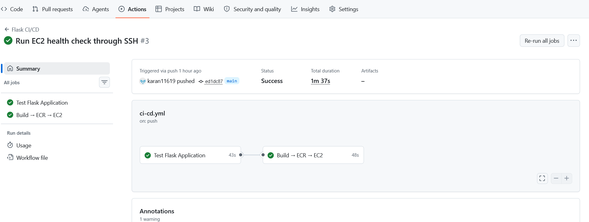
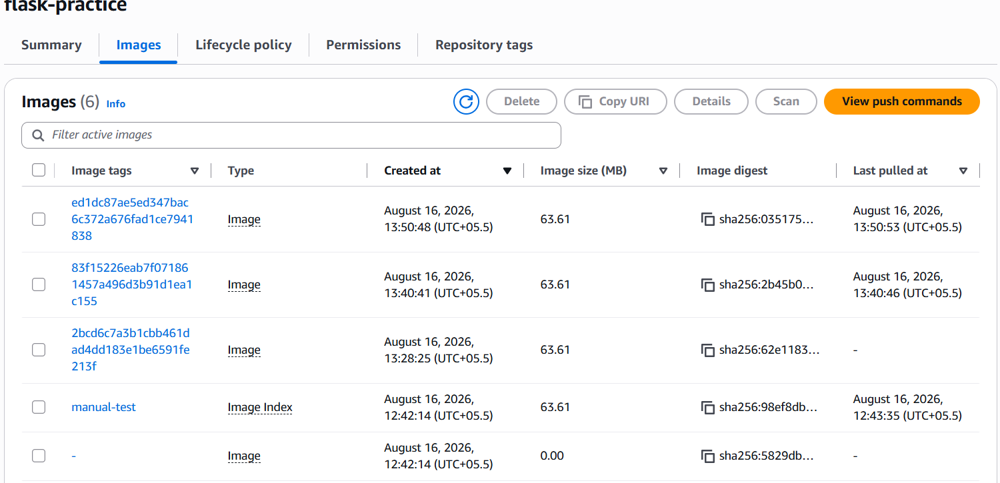
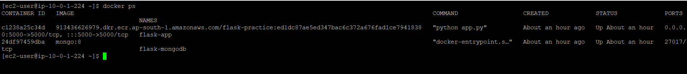
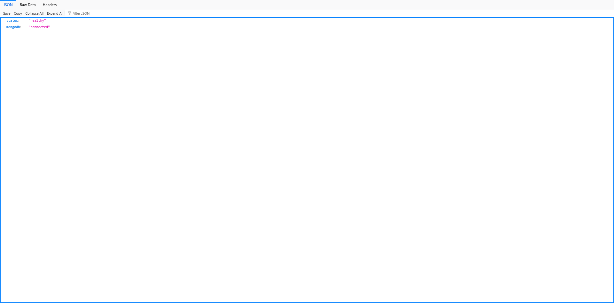

# Flask Practice – CI/CD Pipeline

A Flask + MongoDB student management application deployed to **Amazon EC2 (Amazon Linux 2023)** using **Docker, Amazon ECR, and GitHub Actions**.

The pipeline automatically tests the application, builds a Docker image, pushes the image to ECR using the Git commit SHA, deploys it to EC2, verifies `/health`, and sends an email notification.

**GitHub Repository:**  https://github.com/karan11619/flask_Practice

---

## Architecture

```text
                         ┌──────────────────────────┐
                         │        Developer         │
                         │                          │
                         │ git push → main          │
                         └────────────┬─────────────┘
                                      │
                                      ▼
                         ┌──────────────────────────┐
                         │       GitHub Repo        │
                         │ karan11619/flask_Practice│
                         └────────────┬─────────────┘
                                      │
                                      ▼
                    ┌────────────────────────────────────┐
                    │        GitHub Actions CI/CD        │
                    │                                    │
                    │  1. Checkout                       │
                    │  2. Python 3.13 + MongoDB          │
                    │  3. pytest                         │
                    │  4. Docker build                   │
                    │  5. AWS OIDC authentication        │
                    │  6. Push image to Amazon ECR       │
                    │  7. SSH deployment to EC2          │
                    │  8. EC2 /health verification       │
                    │  9. Email notification             │
                    └───────────────┬────────────────────┘
                                    │
                         GitHub OIDC │
                                    ▼
                         ┌──────────────────────────┐
                         │ AWS IAM Role             │
                         │ flask-practice-          │
                         │ github-actions-role      │
                         └────────────┬─────────────┘
                                      │
                                      ▼
                         ┌──────────────────────────┐
                         │ Amazon ECR               │
                         │ flask-practice           │
                         │                          │
                         │ Immutable SHA tags       │
                         │ flask-practice:<SHA>     │
                         └────────────┬─────────────┘
                                      │
                                      │ docker pull
                                      ▼
              ┌──────────────────────────────────────────────┐
              │              Amazon EC2                      │
              │            Amazon Linux 2023                 │
              │                                              │
              │  ┌────────────────┐   ┌──────────────────┐  │
              │  │   flask-app    │   │  flask-mongodb   │  │
              │  │                │   │                  │  │
              │  │ Flask :5000    │──▶│ MongoDB :27017   │  │
              │  └───────┬────────┘   └──────────────────┘  │
              │          │                                   │
              │          ▼                                   │
              │     /health                                   │
              │          │                                   │
              │          ▼                                   │
              │  {"status":"healthy",                       │
              │   "mongodb":"connected"}                    │
              └──────────────────────────────────────────────┘
                                      │
                                      ▼
                              Email notification
                         SUCCESS / FAILURE
```

---

## Application

This project is a Flask application with MongoDB persistence.

### Features

- View students
- Add students
- Update students
- Delete students
- MongoDB integration
- `/health` endpoint for deployment verification
- Docker containerization
- Automated CI/CD deployment

---

## Main Deployment Evidence

Only the key screenshots are included below to keep the README concise and focused on the assignment deliverables.

### 1. Successful GitHub Actions Pipeline

Shows the end-to-end CI/CD workflow completing successfully, including testing, Docker build, ECR push, EC2 deployment, health check, and notification.

> **Screenshot:** 

### 2. Amazon ECR Image

Shows the `flask-practice` ECR repository with the deployed Git commit SHA image.

> **Screenshot:** 

### 3. EC2 Running Containers

Shows the deployed `flask-app` and `flask-mongodb` containers running on the Amazon Linux EC2 instance.

> **Screenshot:** 

### 4. Health Check

Shows the successful deployment verification response:

```json
{
  "status": "healthy",
  "mongodb": "connected"
}
```

> **Screenshot:** 

## Technology Stack

| Component | Technology |
|---|---|
| Backend | Python / Flask |
| Database | MongoDB 8 |
| Testing | pytest |
| Containerization | Docker |
| Container Registry | Amazon ECR |
| Cloud Server | Amazon EC2 |
| EC2 OS | Amazon Linux 2023 |
| CI/CD | GitHub Actions |
| AWS Authentication | GitHub OIDC |
| Email | Gmail SMTP |
| Region | `ap-south-1` |

---

# CI/CD Pipeline

The workflow is located at:

```text
.github/workflows/ci-cd.yml
```

The pipeline is triggered when code is pushed to the `main` branch.

It can also be started manually using GitHub Actions `workflow_dispatch`.

## Pipeline Flow

```text
Push to main
     │
     ▼
Checkout
     │
     ▼
Run pytest
     │
     ├── FAIL → Pipeline stops
     │
     ▼
Docker Build
     │
     ▼
GitHub OIDC → AWS IAM Role
     │
     ▼
Login to Amazon ECR
     │
     ▼
Push image using Git SHA
     │
     ▼
SSH to EC2
     │
     ▼
Pull image from ECR
     │
     ▼
Stop/remove old flask-app
     │
     ▼
Start new flask-app
     │
     ▼
curl localhost:5000/health
     │
     ├── FAIL → Pipeline fails
     │
     ▼
Send SUCCESS email
```

---

# 1. Automated Testing

The pipeline starts a MongoDB 8 service container and runs the Flask test suite.

Current test suite:

```text
test_home_page
test_add_student
test_update_student
test_delete_student
test_health
```

Expected result:

```text
5 passed
```

The `/health` test verifies:

```json
{
  "status": "healthy",
  "mongodb": "connected"
}
```

---

# 2. Docker Build

The application is containerized using the `Dockerfile`.

Example image format:

```text
913436626979.dkr.ecr.ap-south-1.amazonaws.com/flask-practice:<GIT_SHA>
```

The pipeline uses the Git commit SHA as the Docker image tag.

Example:

```text
flask-practice:ed1dc87ae5ed347bac6c372a676fad1ce7941838
```

This provides traceability between source code and the deployed container.

---

# 3. Amazon ECR

Repository:

```text
flask-practice
```

Region:

```text
ap-south-1
```

Registry:

```text
913436626979.dkr.ecr.ap-south-1.amazonaws.com
```

ECR image tags are configured as **immutable**.

The pipeline checks whether the SHA tag already exists before pushing.

This prevents an existing commit tag from being overwritten.

---

# 4. AWS Authentication

The GitHub Actions workflow does not store an AWS access key or secret key.

Instead, it uses GitHub OpenID Connect (OIDC).

```text
GitHub Actions
      │
      │ OIDC token
      ▼
AWS STS
      │
      ▼
flask-practice-github-actions-role
      │
      ▼
Amazon ECR
```

Workflow permission:

```yaml
permissions:
  contents: read
  id-token: write
```

IAM role:

```text
flask-practice-github-actions-role
```

The IAM trust policy restricts access to the project's GitHub repository and main branch.

---

# 5. EC2 Deployment

The application is deployed to:

```text
Amazon EC2
Amazon Linux 2023
t2.micro
```

The EC2 instance has an IAM role that allows it to pull images from Amazon ECR.

The deployment process:

```text
SSH to EC2
   ↓
ECR login
   ↓
docker pull <image SHA>
   ↓
Stop flask-app
   ↓
Remove flask-app
   ↓
Start new flask-app
```

MongoDB is kept as a separate container:

```text
flask-mongodb
```

The deployment does **not** remove the MongoDB container.

---

# 6. Docker Network

The application and MongoDB containers use:

```text
flask-network
```

The Flask application connects to MongoDB using:

```text
mongodb://flask-mongodb:27017/test_student_db
```

Therefore, the application communicates with MongoDB using the Docker container name:

```text
flask-mongodb
```

---

# 7. Health Check

After deployment, GitHub Actions connects to the EC2 instance through SSH and executes:

```bash
curl http://localhost:5000/health
```

Expected response:

```json
{
  "status": "healthy",
  "mongodb": "connected"
}
```

The deployment is considered successful only when this health check passes.

If the health check fails, the pipeline fails and the failure notification is sent.

---

# 8. Email Notifications

The pipeline sends email notifications for:

### Successful deployment

Subject:

```text
SUCCESS - Flask CI/CD deployment
```

The email includes:

- Repository
- Branch
- Commit SHA
- Docker image
- EC2 deployment status
- Health check status

### Failed pipeline

Subject:

```text
FAILED - Flask CI/CD pipeline
```

The email identifies the repository, branch, commit, and failure status.

Email credentials are stored in GitHub repository secrets.

---

# 9. GitHub Repository Secrets

The following secrets are configured in:

```text
GitHub
→ Settings
→ Secrets and variables
→ Actions
```

| Secret | Purpose |
|---|---|
| `AWS_ROLE_ARN` | AWS IAM role used by GitHub OIDC |
| `EC2_HOST` | EC2 public IPv4 address |
| `EC2_USER` | EC2 SSH user (`ec2-user`) |
| `EC2_SSH_KEY` | OpenSSH private key for EC2 |
| `MONGO_URI` | MongoDB connection string |
| `MAIL_USERNAME` | SMTP username |
| `MAIL_PASSWORD` | SMTP/App password |
| `MAIL_TO` | Notification recipient |
| `MAIL_FROM` | Notification sender |

No AWS access keys are stored in GitHub.

---

# 10. AWS Resources

## ECR

```text
Repository:
flask-practice

Region:
ap-south-1
```

## EC2

```text
Instance type:
t2.micro

Operating system:
Amazon Linux 2023

Application port:
5000

MongoDB port:
27017
```

## IAM Roles

### GitHub Actions role

```text
flask-practice-github-actions-role
```

Used for:

```text
GitHub OIDC → AWS → ECR
```

### EC2 role

```text
flask-practice-ec2-role
```

Used for:

```text
EC2 → ECR image pull
```

---

# 11. Security

The project uses:

- GitHub OIDC instead of long-lived AWS access keys
- GitHub encrypted repository secrets
- Immutable ECR image tags
- IAM roles for GitHub Actions and EC2
- No credentials committed to source control
- `.env`, private keys, and other sensitive files excluded through `.gitignore`

Private keys such as:

```text
*.ppk
*.pem
```

must never be committed to the repository.

---

# 12. Local Development

## Create virtual environment

Windows:

```powershell
python -m venv venv
```

Activate:

```powershell
.\venv\Scripts\Activate.ps1
```

Install dependencies:

```powershell
pip install -r requirements.txt
```

Run tests:

```powershell
pytest -v
```

Expected:

```text
5 passed
```

---

# 13. Run Flask Locally

Set your MongoDB connection in `.env`.

Example:

```env
MONGO_URI=mongodb://localhost:27017/test_student_db
SECRET_KEY=your-secret-key
```

Then:

```powershell
python app.py
```

Application:

```text
http://localhost:5000
```

Health endpoint:

```text
http://localhost:5000/health
```

---

# 14. Docker Build

Build:

```powershell
docker build -t flask-practice:test .
```

Run:

```powershell
docker run -d `
  --name flask-app `
  -p 5000:5000 `
  -e MONGO_URI="mongodb://host.docker.internal:27017/test_student_db" `
  flask-practice:test
```

Verify:

```powershell
curl.exe http://localhost:5000/health
```

---

# 15. Useful EC2 Commands

Check running containers:

```bash
docker ps
```

Check Flask logs:

```bash
docker logs flask-app
```

Check MongoDB logs:

```bash
docker logs flask-mongodb
```

Check application health:

```bash
curl http://localhost:5000/health
```

Check Docker network:

```bash
docker network inspect flask-network
```

Check Docker:

```bash
sudo systemctl status docker
```

---

# 16. Deployment Verification

A successful deployment should show:

```text
Test Flask Application       PASSED
Docker Build                 PASSED
AWS Authentication           PASSED
ECR Push                     PASSED
EC2 Deployment               PASSED
Health Check                 PASSED
Email Notification           SENT
```

Example successful health response:

```json
{
  "status": "healthy",
  "mongodb": "connected"
}
```

---

# 17. Successful Deployment Example

The verified deployment used commit:

```text
ed1dc87ae5ed347bac6c372a676fad1ce7941838
```

ECR image:

```text
913436626979.dkr.ecr.ap-south-1.amazonaws.com/flask-practice:ed1dc87ae5ed347bac6c372a676fad1ce7941838
```

Deployment result:

```text
EC2 Deployment:
SUCCESS

Health Check:
PASSED
```

---

# 18. Troubleshooting

## ECR immutable tag error

If you see:

```text
tag invalid: The image tag already exists
and cannot be overwritten because the tag is immutable
```

The pipeline checks for the existing SHA tag and skips the push.

Create a new commit for a new image tag.

---

## SSH connection timeout

Check:

- EC2 is running
- EC2 has a public IPv4 address
- Security Group allows TCP 22
- `EC2_HOST` contains the current public IP
- EC2 SSH user is `ec2-user`

---

## Health check failure

Connect to EC2 and run:

```bash
docker ps
```

Then:

```bash
curl http://localhost:5000/health
```

Then:

```bash
docker logs flask-app
```

Expected:

```json
{
  "status": "healthy",
  "mongodb": "connected"
}
```

---

# 19. Project Structure

```text
flask_Practice/
│
├── .github/
│   └── workflows/
│       ├── ci-cd.yml
│       ├── securegate.yml
│       └── securegate-summary.yaml
│
├── templates/
│   ├── index.html
│   ├── add_student.html
│   └── update_student.html
│
├── app.py
├── test_app.py
├── requirements.txt
├── Dockerfile
├── .dockerignore
├── .gitignore
├── start_flask.sh
├── azure-pipelines.yml
├── README.md
├── docs/
│   └── screenshots/
│       ├── github-actions-success.png
│       ├── ecr-image.png
│       ├── ec2-docker-ps.png
│       └── health-check.png
└── LICENSE
```

---

# 20. Assignment Completion Checklist

- [x] Fork and clone repository
- [x] Add Dockerfile
- [x] Add `/health` endpoint
- [x] Configure MongoDB
- [x] Create Amazon ECR repository
- [x] Create Amazon EC2 instance
- [x] Configure EC2 IAM role
- [x] Configure GitHub OIDC
- [x] Configure GitHub Actions
- [x] Run automated tests
- [x] Build Docker image
- [x] Push image to ECR
- [x] Deploy image to EC2
- [x] Verify `/health`
- [x] Configure success/failure email notifications
- [x] Use immutable SHA-based ECR tags
- [x] Verify end-to-end deployment
- [ ] Add final screenshots
- [ ] Submit repository link through Vlearn

---

## Conclusion

This project demonstrates an end-to-end AWS CI/CD workflow for a containerized Flask application.

The deployment is automated from GitHub to Amazon ECR and then to an Amazon Linux EC2 instance. Every deployed Docker image is associated with a Git commit SHA, and the deployment is accepted only after the Flask `/health` endpoint confirms both application and MongoDB connectivity.
